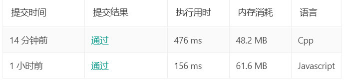

# 单词接龙-leetcode-98

[单词接龙](https://leetcode-cn.com/problems/word-ladder/)

**BFS**

## 题目

```
给定两个单词（beginWord 和 endWord）和一个字典，找到从 beginWord 到 endWord 的最短转换序列的长度。转换需遵循如下规则：

每次转换只能改变一个字母。
转换过程中的中间单词必须是字典中的单词。
说明:

如果不存在这样的转换序列，返回 0。
所有单词具有相同的长度。
所有单词只由小写字母组成。
字典中不存在重复的单词。
你可以假设 beginWord 和 endWord 是非空的，且二者不相同。
示例 1:

输入:
beginWord = "hit",
endWord = "cog",
wordList = ["hot","dot","dog","lot","log","cog"]

输出: 5

解释: 一个最短转换序列是 "hit" -> "hot" -> "dot" -> "dog" -> "cog",
     返回它的长度 5。
示例 2:

输入:
beginWord = "hit"
endWord = "cog"
wordList = ["hot","dot","dog","lot","log"]

输出: 0

解释: endWord "cog" 不在字典中，所以无法进行转换。

来源：力扣（LeetCode）
链接：https://leetcode-cn.com/problems/word-ladder
著作权归领扣网络所有。商业转载请联系官方授权，非商业转载请注明出处。
```

## 代码

### cpp 代码

```cpp

class Solution {
public:
    int ladderLength(string beginWord, string endWord, vector<string>& wordList) {
        map<string, vector<string>> dict;
        int wordListLength = wordList.size();
        int wordLength = beginWord.size();
        for(int i=0; i<wordListLength; i++) {
          for(int j=0; j<wordLength; j++) {
            string newWord = wordList[i].substr(0, j) + '*' + wordList[i].substr(j+1);
            vector<string> value;
            if(dict.count(newWord) == 1) {
              value = dict[newWord];
            }
            value.push_back(wordList[i]);
            dict[newWord] = value;
          }
        }
        queue<pair<string, int>> q;
        q.push(pair<string, int>(beginWord, 1));
        map<string, bool> visited;
        visited[beginWord] = true;
        while(!q.empty()) {
          pair<string, int> curNode = q.front();
          q.pop();
          string curWord = curNode.first;
          int curLevel = curNode.second;
          for(int i=0; i<wordLength; i++) {
            string newWord = curWord.substr(0, i) + '*' + curWord.substr(i+1);
            if(dict.count(newWord) == 1) {
              vector<string> tmpWords = dict[newWord];
              for(int j=0; j<tmpWords.size(); j++) {
                if(tmpWords[j] == endWord) return curLevel+1;
                if(visited.count(tmpWords[j]) == 0) {
                  visited[tmpWords[j]] = true;
                  q.push(pair<string, int>(tmpWords[j], curLevel+1));
                }
              }
            }
          }
        }
        return 0;
    }

};

// 20 ms 答案
class Solution2 {
public:
    int ladderLength(string beginWord, string endWord, vector<string>& wordList) {
        unordered_set<string> st(wordList.begin(),wordList.end());
        if(st.count(endWord) == 0) return 0;
        
        unordered_set<string> st1{beginWord},st2{endWord};
        int step = 1;
        while(st1.size()){
            step++;
            unordered_set<string> tempSt;
            for(auto &item:st1)
                st.erase(item);
            
            for(auto item:st1){
                for(int i=0;i<item.size();i++){
                    string str = item;
                    for(char c = 'a';c <= 'z';c++){
                        str[i] = c;    
                        if(st.count(str) == 0) continue;
                        // 这样可以直接得到最优解
                        if(st2.count(str)) return step;
                        tempSt.insert(str);                        
                    }
                }
            }
            
            // 这里就需要根据情况，更新st1了
            // 保证每次st1集合最小，这样就可以每次从最小的那一端开始搜索
            if(tempSt.size() < st2.size()) st1 = tempSt;
            else {
                st1 = st2;
                st2 = tempSt;
            }
        }
        return 0;
    }
};

```

### JS代码
```js
/**
 * @param {string} beginWord
 * @param {string} endWord
 * @param {string[]} wordList
 * @return {number}
 */
var ladderLength = function(beginWord, endWord, wordList) {
    if(!endWord || wordList.indexOf(endWord) == -1) return 0;
    let comboDicts = {};
    let len = beginWord.length;
    for(let i=0; i<wordList.length; i++) {
      for(let r=0; r<len; r++) {
        const newWord = wordList[i].substring(0,r) + '*' + wordList[i].substring(r+1, len);
        (!comboDicts[newWord]) && (comboDicts[newWord] = []);
        comboDicts[newWord].push(wordList[i]);
      }
    }
    let queue = [[beginWord, 1]];
    let visited = {beginWord: true};
    while(queue.length > 0) {
      const curNode = queue.shift();
      const curWord = curNode[0];
      const curLevel = curNode[1];
      for(let i=0; i<len; i++) {
        const newWord = curWord.substring(0, i)+'*'+curWord.substring(i+1, len);
        if(newWord in comboDicts) {
          const tmpWords = comboDicts[newWord];
          for(let j=0; j<tmpWords.length; j++) {
            if(tmpWords[j] === endWord) return curLevel+1;
            if(!visited[tmpWords[j]]) {
              visited[tmpWords[j]] = true;
              queue.push([tmpWords[j], curLevel+1]);
            }
          }
        }
      }
    }
    return 0;
};
```

另外比较迷的就是耗时了,C++竟然比JavaScript耗时还长


