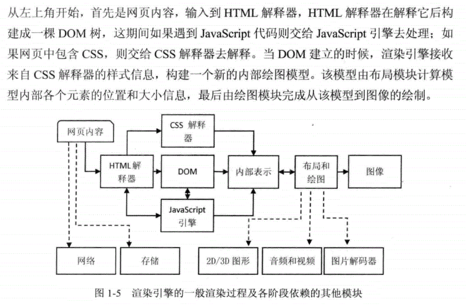
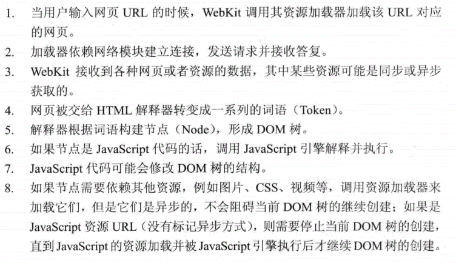

## 加载与渲染

浏览器的主要作用就是把用户输入的URL转化为可视化的图像,其中包含两个过程:
* 其一是网页加载加载过程，从网页URL到构建DOM树
* 其二是网页渲染过程，从DOM树生成可视化图像

### 浏览器的一般渲染过程

## 具体的渲染过程

## 总结

输入URL(以:www.baidu.com为例) --> DNS查询(cname->ip) --> 浏览器发起请求 --> TCP连接 --> 接收数据(index.html)--> 断开TCP连接 --> HTML解析该文档形成DOM树,若中间需要加载图片,CSS,视频(均为异步加载,不阻碍DOM树构建),这期间遇到JS则交给JS引擎去执行, 若遇到JS URL标记的资源(一般情况下是阻塞DOM树构建,等JS加载和执行后才继续进行DOM构建)CSS则交给CSS解释器去执行 --> DOM建立完成后，渲染引擎接受来自CSS解释器的样式信息，构建一个新的内部绘图模型 --> 布局模块渲染该绘图模型,完成绘制

script async 属性 --> 异步加载,同步执行(下载不会阻塞HTML解析，下载后会立即执行(会阻塞))

script defer 熟悉 --> 异步加载,异步执行(下载不会阻塞HTML解析，会等HTML解析完成后在执行)

Reflow（回流）：浏览器要花时间去渲染，当它发现了某个部分发生了变化影响了布局，那就需要倒回去重新渲染。(更耗时，应避免)

Repaint（重绘）：如果只是改变了某个元素的背景颜色，文字颜色等，不影响元素周围或内部布局的属性，将只会引起浏览器的repaint，重画某一部分

## 参考文献

* https://max.book118.com/html/2019/0103/6051221055001243.shtm
* https://blog.csdn.net/xiaozhuxmen/article/details/52014901
  